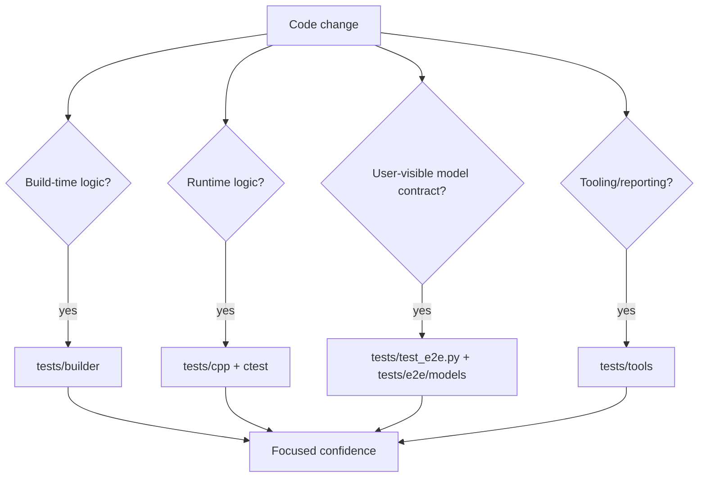
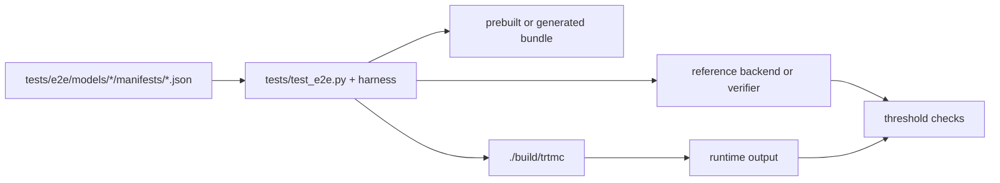

The test tree is split by responsibility.

## Builder tests

Path: `tests/builder/`

Use for:

- Python family plugin behavior.
- Graph ops and graph blocks.
- Engine builder orchestration.
- Quantization and calibration logic.
- Config schema and CLI coverage.

Builder tests are the right place to validate that a model family can be identified, weights can be mapped, config fields are interpreted correctly, and bundle metadata is emitted as intended.

## C++ tests

Path: `tests/cpp/`

Use for:

- Public API behavior.
- Bundle parsing.
- Pipeline registry and plugin creation.
- Tokenizers.
- Runtime core classes.
- Domain helpers and generation plans.

C++ tests should protect ownership boundaries. If a plugin should be
registered without editing the factory, test native model-DSO loading, backend
selection, and the strategy registry. For an optimized implementation, test
that `optimized_runtime.json` claims the bundle before native dispatch, that
the integrity-bound embedded `libtrtmc_impl_*.so` is the only accepted
implementation library, and that identity/ABI mismatches fail closed. Test
each model-owned inference-state or cache lifecycle directly against that
owner's contract.

## Tool tests

Path: `tests/tools/`

Use for:

- Diff tools.
- Report generation.
- Performance comparison utilities.
- Coverage selection.
- Runtime strategy matrix checks.

## E2E tests

Paths:

- `tests/test_e2e.py`
- `tests/e2e/models/*/MODEL.toml`
- `tests/e2e/models/*/manifests/*.json`
- `tests/e2e_harness/`

E2E manifests are user-contract evidence. A native manifest defines the model,
bundle, family, exact `runtime_strategy`, reference backend, prompts or modality
inputs, and pass/fail thresholds. An optimized implementation instead adds the
family-owned `IMPLEMENTATION.toml`, an exact qualified `profiles/*.toml` entry,
and matching `QUALIFICATION.*.toml` producer proof. Its built bundle carries
`optimized_runtime.json`, implementation metadata, integrity-bound artifacts,
and the embedded implementation DSO; its public `runtime_strategy` may be
empty.

## Choosing coverage

| Change type | Minimum useful coverage |
| --- | --- |
| New native supported model | Family plugin tests, model-owned runtime DSO/registry/backend tests, and one exact-model E2E manifest. |
| Additional native strategy for an existing runtime owner | Owner manifest and plugin tests, pipeline tests, CLI/API test if exposed, and one E2E manifest. |
| New optimized implementation/profile | `IMPLEMENTATION.toml` and profile validation, matching `QUALIFICATION.*.toml`, embedded-DSO/host fail-closed tests, and retained qualified parity/performance artifacts. |
| New config namespace | Python and C++ config schema tests, CLI `--set` tests, effective config checks. |
| New quantization format | Quantization plan tests, calibration/scale tests, one numerical E2E. |
| New report or scheduling behavior | Tool tests plus one small fixture artifact. |
| ABI or backend selection behavior | Backend loader tests and a smoke run with diagnostic output. |

## What E2E proves and does not prove

E2E is the highest-level user contract, but it is not a replacement for unit tests.

| E2E proves | E2E usually does not prove |
| --- | --- |
| A named model manifest can run through the public CLI/runtime. | Every edge case inside a cache, tokenizer, or scheduler. |
| Output matches an oracle within the manifest's tolerance. | That performance is optimal. |
| Bundle metadata and the selected native strategy or optimized implementation/profile are coherent. | That every unsupported configuration fails clearly. |
| The verifier path works for that modality. | That the builder internals are fully covered. |

Use E2E for confidence that a feature works as users see it. Use unit tests to make failures precise and cheap to debug.

Timing evidence also follows the implementation boundary. Native pipelines may
populate `setup_ms`, `prefill_ms`, and `decode_ms` in `TextResult`; optimized
providers populate only timing their delegated API can support. A zero phase
value is not proof of zero latency. When a trustworthy phase split is
unavailable, retain synchronized wall-clock measurements around the public
pipeline call and label phase metrics unavailable.
