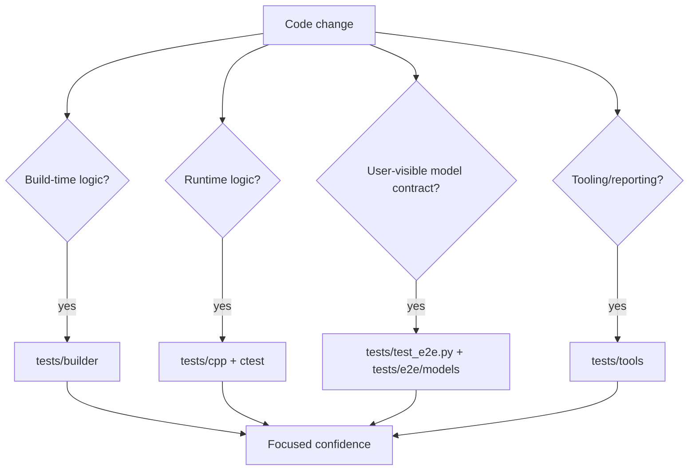
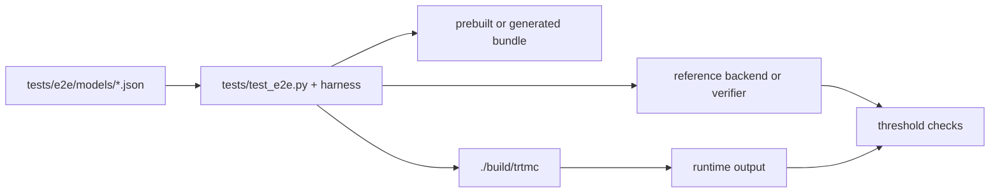

The test tree is split by responsibility.

## Builder tests

Path: `tests/builder/`

Use for:

- Python family plugin behavior.
- Graph ops and graph blocks.
- Engine builder orchestration.
- Quantization and calibration logic.
- Config schema and CLI coverage.
- Torch-TRT engine definitions.

Builder tests are the right place to validate that a model family can be identified, weights can be mapped, config fields are interpreted correctly, and bundle metadata is emitted as intended.

## C++ tests

Path: `tests/cpp/`

Use for:

- Public API behavior.
- Bundle parsing.
- Pipeline registry and plugin creation.
- Tokenizers.
- Runtime core classes.
- Domain helpers and generation plans.

C++ tests should protect ownership boundaries. If a plugin should be registered without editing the factory, test the registry. If a cache class should satisfy `IInferenceState`, test the lifecycle directly.

## Tool tests

Path: `tests/tools/`

Use for:

- Diff tools.
- Report generation.
- Performance comparison utilities.
- Coverage selection.
- Runtime strategy matrix checks.

## E2E tests

Paths:

- `tests/test_e2e.py`
- `tests/e2e/models/*.json`
- `tests/e2e_harness/`

E2E manifests are user-contract evidence. They define the model, bundle, family, runtime strategy, reference backend, prompts or modality inputs, and pass/fail thresholds.

## Choosing coverage

| Change type | Minimum useful coverage |
| --- | --- |
| New Python family using existing runtime strategy | Family plugin tests plus one E2E manifest. |
| New runtime strategy | C++ registry/plugin tests, pipeline tests, CLI/API test if exposed, and one E2E manifest. |
| New config namespace | Python and C++ config schema tests, CLI `--set` tests, effective config checks. |
| New multi-device plan or mesh behavior | Builder plan tests, C++ distributed runtime tests, and at least one multi-device E2E manifest with an oracle comparison. |
| New quantization format | Quantization plan tests, calibration/scale tests, one numerical E2E. |
| New report or scheduling behavior | Tool tests plus one small fixture artifact. |
| ABI or backend selection behavior | Backend loader tests and a smoke run with diagnostic output. |

## What E2E proves and does not prove

E2E is the highest-level user contract, but it is not a replacement for unit tests.

| E2E proves | E2E usually does not prove |
| --- | --- |
| A named model manifest can run through the public CLI/runtime. | Every edge case inside a cache, tokenizer, or scheduler. |
| Output matches an oracle within the manifest's tolerance. | That performance is optimal. |
| Bundle metadata and runtime strategy are coherent. | That every unsupported configuration fails clearly. |
| The verifier path works for that modality. | That the builder internals are fully covered. |

Use E2E for confidence that a feature works as users see it. Use unit tests to make failures precise and cheap to debug.

For multi-device features, builder tests that prove rank-local sections and `distributed_plan.json` are emitted are not runtime validation. The user-visible contract is only proven when the distributed launch produces rank-zero or task-specific output and the E2E comparator checks it against the selected oracle.
