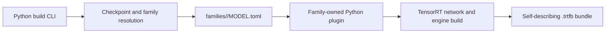

# Architecture Overview

Status: current overview; source and descriptors remain authoritative.

## Build phase

The CLI is implemented by
`python/tensorrt_model_connect/build_cli.py`. Family discovery is implemented
by `python/tensorrt_model_connect/families/__init__.py`; it scans family
descriptors and imports the selected package. The family owns checkpoint
mapping and graph semantics. `bundle_writer.py` serializes engine and metadata
sections.

## Runtime phase

```mermaid
flowchart LR
  Entry["CLI, C API, or C++ API"] --> Factory["PipelineFactory"]
  Factory --> Bundle["Bundle materialization"]
  Bundle --> Strategy["Resolve runtime_strategy"]
  Strategy --> Loader["Load owning model DSO"]
  Loader --> Registry["PipelineRegistry lookup"]
  Registry --> Pipeline["Family-owned IPipeline"]
  Pipeline --> Result["Typed result"]
```

`src/runtime/registry/pipeline_factory.cpp` performs bundle materialization,
strategy resolution, DSO loading, config resolution, and plugin creation.
Generated runtime-manifest data maps each strategy to its library. The factory
does not contain a hand-written switch over model families.

## Ownership boundary

- Shared code owns public API, bundle transport, config resolution, DSO
  discovery, registry mechanics, device abstractions, and genuinely
  model-independent helpers.
- A model family owns checkpoint semantics, graph construction, runtime state,
  pipeline behavior, strategy registration, model tests, and E2E contracts.
- CMake discovers runtime plugins from
  `src/runtime/models/*/MODEL.toml`; contributors do not append a central list.

## Strategy vocabulary

`task_strategy` describes a reusable operation/test contract, such as
`text_generation_causal`. `runtime_strategy` identifies the concrete runtime
implementation and is normally family-qualified. Legacy generic aliases may
be normalized for old bundles, but new bundles and docs must use the strategy
declared by the owning runtime descriptor.

## Configuration

Runtime configuration is resolved through schemas in `src/runtime/config/`
and optional model-owned schemas declared in runtime descriptors. Bundle
defaults, config files, CLI overrides, and platform/session layers are
resolved before plugin creation. Documentation should not invent an
environment-variable contract unless a current parser or source reader proves
it.

This page is descriptive, not ISO 26262 certification evidence. See the live
[Architecture section](../architecture/overview.md) for user-facing details.
