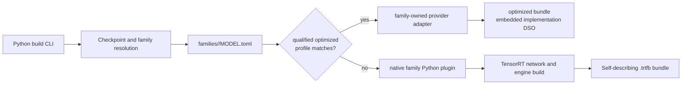
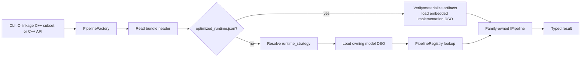

# Architecture Overview

Status: current overview; source and descriptors remain authoritative.

## Build phase

The CLI is implemented by
`python/tensorrt_model_connect/build_cli.py`. Family discovery is implemented
by `python/tensorrt_model_connect/families/__init__.py`, with three distinct
flows. A full config tries architecture-pattern descriptor candidates before
the all-package `pkgutil` compatibility fallback. A string or `model_type`
tries a direct descriptor ID, then alias/prefix candidates, then that fallback.
A Diffusers pipeline class uses descriptor `diffusion_pipeline_classes` only
and has no `pkgutil` fallback. In every descriptor route, discovery imports the
family package and reads its package-level `plugin`; descriptor `module` is
specialization/tooling metadata, not an arbitrary import selector. After family
resolution, `runtime_provider/` probes only that family's optimized
implementations. One exact qualified profile may claim the
model/revision/target/options tuple; otherwise the native family plugin owns
checkpoint mapping and graph semantics.

## Runtime phase

`src/runtime/registry/pipeline_factory.cpp` first selects the bundle kind. The
optimized host verifies the content-addressed artifact tree and private factory
identity, then asks the embedded `libtrtmc_impl_*.so` for an `IPipeline`.
Otherwise the factory performs native materialization, strategy resolution,
model/backend DSO loading, config resolution, and plugin creation. Generated
runtime-manifest data maps each native strategy to its library. Neither path
contains a hand-written switch over model families.

## Ownership boundary

- Shared code owns public API, bundle transport, config resolution, DSO
  discovery, registry mechanics, device abstractions, and genuinely
  model-independent helpers.
- A model family owns checkpoint semantics, graph construction, runtime state,
  pipeline behavior, strategy registration, model tests, and E2E contracts.
- CMake discovers native runtime plugins from
  `src/runtime/models/*/MODEL.toml`; contributors do not append a central list.

## Strategy vocabulary

`task_strategy` describes a reusable operation/test contract, such as
`text_generation_causal`. For native bundles, `runtime_strategy` identifies
the concrete runtime implementation and is normally family-qualified. Legacy
generic aliases may be normalized for old native bundles. Optimized bundles
instead carry an implementation/profile descriptor and embedded DSO; they do
not synthesize a native strategy.

## Configuration

Runtime configuration is resolved through schemas in `src/runtime/config/`
and optional model-owned schemas declared in runtime descriptors. Bundle
defaults, config files, CLI overrides, and platform/session layers are
resolved before plugin creation. Documentation should not invent an
environment-variable contract unless a current parser or source reader proves
it.

This page is descriptive, not ISO 26262 certification evidence. See the live
[Architecture section](../architecture/overview.md) for user-facing details.
