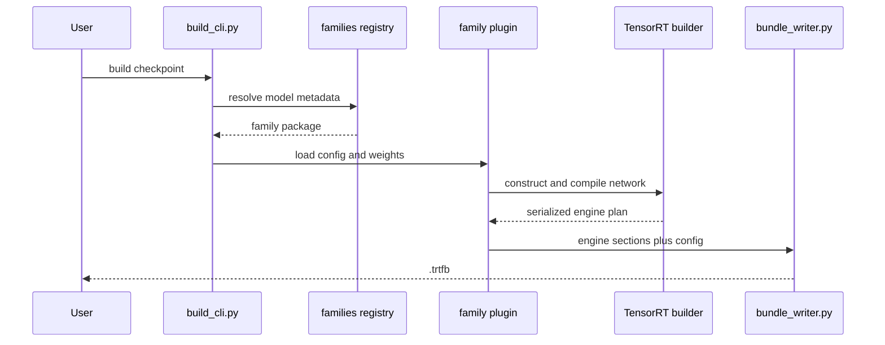
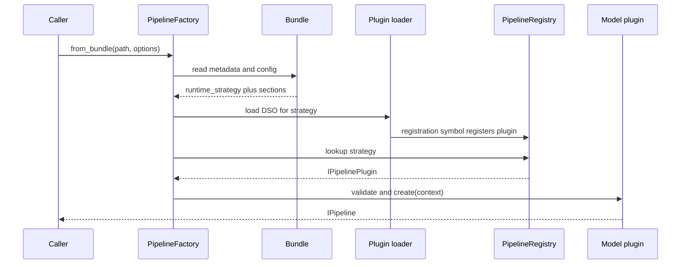

# Dynamic Design

Status: current contract-level sequences.

## Build sequence

Family resolution is descriptor-driven. A family may own multiple engines or
special build phases; the diagram shows the common control boundary, not an
assumption that every model is a decoder.

## Pipeline creation sequence

If the bundle omits `runtime_strategy`, creation succeeds only when generated
runtime-manifest data defines a default. An unknown strategy, missing DSO, or
missing registration fails explicitly.

## Request sequence

The caller invokes one operation from `IPipeline`. The family pipeline
validates request support, owns model state and GPU execution, and returns the
operation's typed result. Text generation may have prefill/decode and KV-cache
state; encoder, diffusion, audio, vision, segmentation, and time-series
pipelines follow their own model-owned sequences.

## Config sequence

Before plugin creation, schema defaults and available bundle/file/CLI/session
layers are resolved into a `ConfigBundle`. Platform-wide sinks are applied by
the factory; model schemas are consumed by their owning plugin. The C++ CLI
rejects invalid explicit `--config`/`--set` input before dispatch. A direct
`PipelineFactory` caller can currently receive only a warning and a fallback
to plugin-local behavior after resolution fails, so library callers must inspect
diagnostics or enforce fail-fast behavior themselves.
