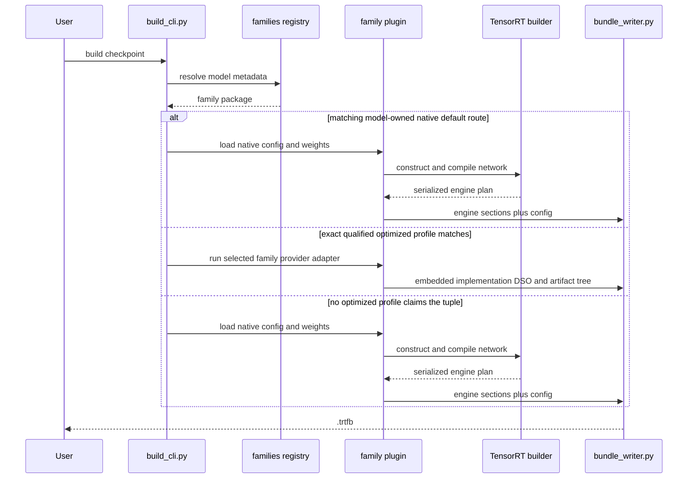
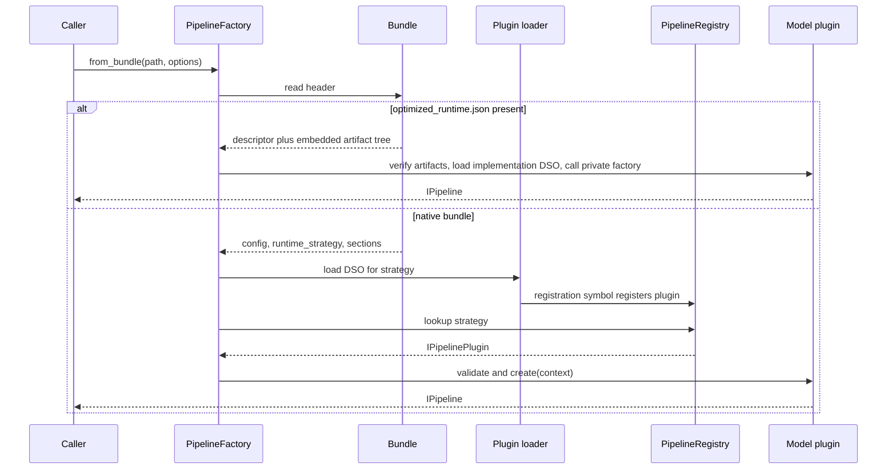

# Dynamic Design

Status: current contract-level sequences.

## Build sequence

Family resolution is descriptor-driven. A family may own multiple engines or
special build phases; the diagram shows the common control boundary, not an
assumption that every model is a decoder.

Eligible dense Qwen3 and Llama currently use the native-default branch and do
not probe optimized providers.

## Pipeline creation sequence

For a native bundle, omission of `runtime_strategy` succeeds only when
generated runtime-manifest data defines a default. An unknown strategy,
missing DSO, or missing registration fails explicitly. For an optimized
bundle, presence of `optimized_runtime.json` claims that path; an invalid
descriptor, artifact, or implementation DSO fails without native fallback.

## Request sequence

The caller invokes one operation from `IPipeline`. The family pipeline
validates request support, owns model state and GPU execution, and returns the
operation's typed result. Text generation may have prefill/decode and KV-cache
state; encoder, diffusion, audio, vision, segmentation, and time-series
pipelines follow their own model-owned sequences.

## Config sequence

Before native plugin creation, the factory resolves schema defaults, any
`defaults` object extracted from the materialized `config.json` text, and the
session request supplied through `LoadOptions.config_path` and
`LoadOptions.set_tokens`. Although `ConfigBundle` defines build-time and
platform-profile layer types, this factory path does not inject separate
contributions for them. Platform-wide sinks are applied after successful
resolution, and model schemas are consumed by their owning plugin.

The C++ CLI separately validates explicit `--config`/`--set` input before
dispatch and exits nonzero on failure. A direct `PipelineFactory` call catches
runtime-config resolution errors, writes a warning, and continues with no
resolved runtime config. Library callers that require fail-fast behavior must
enforce it around that warning path.
