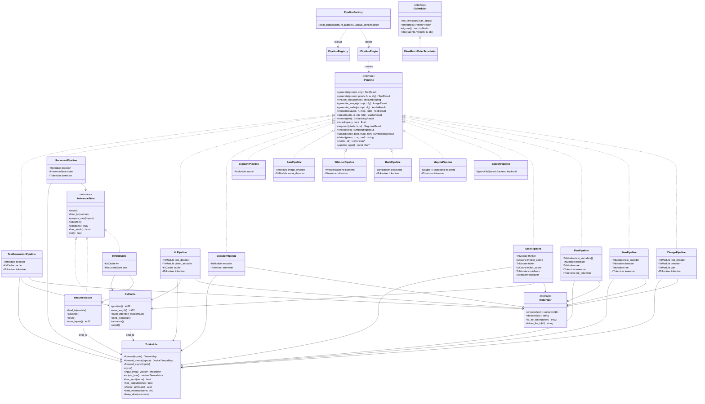

# Static Design

| Field | Value |
|---|---|
| **Document ID** | TRTMC-SD-001 |
| **Title** | Software Unit Design Specification |
| **Standard** | ISO 26262-6:2018 clause 8 |
| **Scope** | C++ runtime and Python build package |
| **Status** | Living document, auto-verified against source tree |
| **Author** | Safety Architecture Team (TensorRT-Model-Connect Team) |
| **Reviewer** | Independent Review Required (TBD — assign before merge) |
| **Review Status** | Pending independent review |

---

## 1. Purpose

This document specifies the static structure of the tensorrt-model-connect
system: every class, interface, and dependency described here maps to a real
source file. No aspirational content is included.

The system has two stages:

1. **Python build** (`python/tensorrt_model_connect/`) -- converts HuggingFace models into
   self-describing `.trtfb` bundles containing serialized TensorRT engine
   plans, tokenizer data, and JSON config.
2. **C++ runtime** -- loads `.trtfb` bundles, deserializes TRT engines, and
   runs inference through the `IPipeline` interface.

---

## 2. C++ Runtime Class Diagram

### Registry Components (not shown in diagram)

- `PipelineRegistry` -- singleton that maps strategy strings to `IPipelinePlugin*` instances.
- `IPipelinePlugin` -- interface with `create(PipelineContext&) -> unique_ptr<IPipeline>`.
- `REGISTER_PIPELINE_PLUGIN_WITH_MANIFEST` -- helper macro for manifest registration functions.
- `BaseConfig` -- universal ~10-field config struct parsed by `parse_base_config()`.
- `PipelineContext` -- non-owning struct passed to each plugin: `{bundle, config, config_json, hf_python, bundle_path}`.
- Model runtime folders in `src/runtime/models/` register 25 strategies total.

---

## 3. C++ Runtime Unit Designs

### UD-CABI-01: C ABI Entry Point

| Field | Value |
|---|---|
| **Files** | `src/cabi/api/trtmc_c.cpp` |
| **Public header** | `include/trtmc/pipeline.h` (C ABI section at bottom) |
| **Purpose** | Exposes `trtmc_create_pipeline()`, `trtmc_create_pipeline_ex()`, `trtmc_last_error()`, `trtmc_version()`, `trtmc_has_trt()` as C-linkage functions. Bridges external callers (CLI, FFI) to the C++ `PipelineFactory`. |
| **Behavior** | Delegates to `PipelineFactory::from_bundle()`. Catches all exceptions and stores the error message for retrieval via `trtmc_last_error()`. Returns raw `IPipeline*` (caller owns). |

### UD-CFG-01: Bundle Config Parsing

| Field | Value |
|---|---|
| **Files** | `include/trtmc/runtime/pipeline_plugin.h`, `src/runtime/registry/pipeline_plugin.cpp` |
| **Purpose** | Parses the JSON config section from a `.trtfb` bundle into `BaseConfig` (universal fields). Each plugin parses its own strategy-specific fields directly from the raw JSON text. |
| **Key fields** | `BaseConfig` contains: `runtime_strategy`, `vocab_size`, `hidden_size`, `num_layers`, `num_heads`, `num_kv_heads`, `head_dim`, `attention_size`, `max_cache_length`, `id_bos`, `id_eos`, `precision`, `tokenizer_add_special_tokens`. Strategy-specific fields (Mamba SSM, Whisper, VL, diffusion, audio, etc.) are parsed by each plugin from `ctx.config_json`. |
| **Invariant** | All `BaseConfig` fields have safe defaults. Unknown JSON keys are silently ignored. |

### UD-BDL-01: Bundle Format

| Field | Value |
|---|---|
| **Files** | `src/bundle/bundle_format.h`, `src/bundle/bundle_format.cpp` |
| **Public header** | `include/trtmc/bundle.h` |
| **Purpose** | Reads `.trtfb` bundle files. Format: 8-byte magic (`TRTFB\x00\x01\x00`), 8-byte LE JSON header length, JSON metadata, then binary sections at offsets. |
| **Functions** | `ReadBundleFile()` (full load), `ReadBundleHeader()` (metadata only), `HasBundleMagic()` (validation). |
| **Public API** | `BundleInfo InspectBundle()`, `bool IsBundle()` -- thin wrappers for external callers. |

### UD-BDL-02: Plugin Helpers

| Field | Value |
|---|---|
| **Files** | `src/runtime/plugins/shared/plugin_helpers.h`, `src/runtime/plugins/shared/plugin_helpers.cpp` |
| **Purpose** | Shared plumbing for pipeline plugins: `find_section()` extracts named sections from bundles, `load_trt_module_from_plan()` deserializes TRT engine plans, `create_tokenizer_from_bundle()` creates tokenizers, `compute_kv_dim()` derives KV dimensions from config. |

### UD-FAC-01: Pipeline Factory and Plugin Registry

| Field | Value |
|---|---|
| **Files** | `include/trtmc/runtime/pipeline_factory.h`, `src/runtime/registry/pipeline_factory.cpp`, `include/trtmc/runtime/pipeline_registry.h`, `src/runtime/registry/pipeline_registry.cpp`, `include/trtmc/runtime/pipeline_plugin.h`, `src/runtime/registry/pipeline_plugin.cpp` |
| **Purpose** | Sole creation path for all pipelines. `PipelineFactory::from_bundle()` reads a `.trtfb`, parses `BaseConfig`, and delegates to the registry-resolved `IPipelinePlugin`. |
| **Dispatch** | `PipelineRegistry` singleton maps `runtime_strategy` strings to manifest-registered `IPipelinePlugin` instances. Each model runtime folder in `src/runtime/models/` handles one or more strategies and exposes a registrar function listed in `cmake/trtmc_pipeline_plugins.cmake`. 25 strategies are registered across model-owned plugin files. |
| **Strategy mapping** | `decoder_kv_cache`/`decoder_moe` -> `TextGenerationPipeline`; `ssm_recurrent`/`rwkv_recurrent`/`hybrid_mamba_attention` -> `RecurrentPipeline`; `encoder_only`/`embedding`/`reranking`/`neural_operator` -> `EncoderPipeline`; `vision_language` -> `VLPipeline`; `segmentation` -> `SegmentPipeline`; `prompted_segmentation` -> `SamPipeline`; `object_detection` -> `EncoderPipeline`; `speech_to_text` -> `WhisperPipeline`; `text_to_audio_bark` -> `BarkPipeline`; `text_to_audio_magpie` -> `MagpiePipeline`; `speech_to_speech` -> `SpeechPipeline`; `omni_multimodal` -> `OmniPipeline`; `text_to_text` -> `T5Pipeline`; `marian_translation` -> `MarianPipeline`; `seq2seq_encoder_decoder` -> `Seq2SeqPipeline`; `diffusion_flux` -> `FluxPipeline`; `diffusion_wan`/`diffusion_pixart` -> `WanPipeline`; `diffusion_zimage` -> `ZImagePipeline`. |

### UD-MOD-01: TRT Module

| Field | Value |
|---|---|
| **Files** | `include/trtmc/runtime/trt_module.h`, `src/runtime/backend/trt_module_impl.cpp` |
| **Purpose** | `model.forward()` abstraction for TensorRT engines. Wraps `ICudaEngine` + `IExecutionContext`. Manages all I/O binding, H2D/D2H transfers, and execution. |
| **Key API** | `forward()` (CPU tensors, synchronous), `forward_device()` (GPU tensors, no copies), `forward_async()`/`sync()` (async), `bind_external()` (KvCache binding), `device_ptr()` (direct buffer access). |
| **Ownership** | Non-copyable, movable. `keep_alive()` stores `shared_ptr<void>` to ensure TRT engine and CUDA stream outlive the execution context. |
| **Related** | `include/trtmc/runtime/tensor.h` (CPU Tensor, TensorMap, DType), `include/trtmc/runtime/device_tensor.h` (GPU DeviceTensor). |

### UD-KVC-01: KV Cache

| Field | Value |
|---|---|
| **Files** | `include/trtmc/runtime/kv_cache.h`, `src/runtime/core/kv_cache.cpp`, `src/runtime/core/device_kv_cache.h`, `src/runtime/core/device_kv_cache.cpp` |
| **Purpose** | Autoregressive KV cache state manager. Allocates per-layer K/V device tensors, builds causal attention masks, and binds directly to TrtModule. |
| **Key API** | `bind_to()` binds `cache_k_{i}`, `cache_v_{i}` (inputs) and `present_k_{i}`, `present_v_{i}` (outputs). `advance()` appends present into cache and increments position. `build_attention_mask()` produces `[max_length]` float mask. |
| **Legacy** | `device_kv_cache.h/cpp` contains the older `DeviceKvCache` and `run_decoder_step_device()` used by legacy backends. |

### UD-REC-01: Recurrent State

| Field | Value |
|---|---|
| **Files** | `include/trtmc/runtime/recurrent_state.h`, `src/runtime/core/recurrent_state.cpp` |
| **Purpose** | Config-driven SSM/RWKV state manager. Replaces old `MambaStepState` and `RwkvStepState` with a single class parametrized by `TensorSpec` array. |
| **Key API** | `bind_to()` binds state tensors (`{name}_{i}`) and present tensors (`{output_prefix}_{i}`). `advance()` copies present->state (D2D async). `reset()` zeros all state. |
| **Usage** | Mamba: `specs = {{"conv_state", ...}, {"ssm_state", ...}}`. RWKV: `specs = {{"attn_state", ...}, ...}`. |

### UD-TOK-01: Tokenizers

| Field | Value |
|---|---|
| **Files** | `include/trtmc/tokenizer.h`, `include/trtmc/runtime/tokenizer_interface.h`, `src/tokenizer/vocab_tokenizer.cpp`, `src/tokenizer/bpe_tokenizer.cpp`, `src/tokenizer/ipa_tokenizer.cpp` |
| **Purpose** | `ITokenizer` interface with three concrete implementations. `include/trtmc/tokenizer.h` defines the full interface (`encode`, `decode`, `id_for_token`, `token_for_id`) plus factory functions. `include/trtmc/runtime/tokenizer_interface.h` defines a minimal `encode`/`decode`-only interface. |
| **Implementations** | `VocabTokenizer` -- vocab.txt lookup. `HfPythonTokenizer` -- bridges to HuggingFace via Python subprocess. `IpaTokenizer` -- IPA phoneme tokenizer for speech models. |

### UD-PIP-TEXT-01: Text Generation Pipeline

| Field | Value |
|---|---|
| **Files** | `src/runtime/models/text_generation/pipeline.h`, `src/runtime/models/text_generation/pipeline.cpp` |
| **Purpose** | Serves all decoder-only LLMs (Qwen, LLaMA, Mistral, GPT-2, etc.) and MoE decoders (Mixtral, Phi-MoE). Composes TrtModule + KvCache + ITokenizer. Runs prefill->decode loop with greedy argmax. |
| **Key API** | `generate()` (text in, `TextResult` out), `generate_ids()` (token IDs in/out for testing). |

### UD-PIP-REC-01: Recurrent Pipeline

| Field | Value |
|---|---|
| **Files** | `src/runtime/models/recurrent/pipeline.h`, `src/runtime/models/recurrent/pipeline.cpp` |
| **Purpose** | Serves Mamba, RWKV, and Hybrid (Nemotron-H) models. Uses `IInferenceState` to abstract between pure recurrent (`RecurrentState`) and hybrid attention+recurrent (`HybridState`). |
| **Key API** | Same `generate()` / `generate_ids()` interface as TextGenerationPipeline. |
| **State implementations** | `RecurrentState`: SSM/RWKV state (no mask, position tracked internally). `HybridState`: composes `KvCache` + `RecurrentState` (has mask, position from KvCache). Both implement `IInferenceState`. |

### UD-PIP-VL-01: VL Pipeline

| Field | Value |
|---|---|
| **Files** | `src/runtime/models/vision_language/pipeline.h`, `src/runtime/models/vision_language/pipeline.cpp` |
| **Purpose** | Vision-language generation (Qwen2.5-VL, Qwen3-VL, InternVL3, Phi4). Composes text decoder TrtModule + optional vision encoder TrtModule + KvCache + ITokenizer + image preprocessor. |
| **Key API** | `generate(prompt, cfg)` for text-only, `generate(prompt, pixels, h, w, cfg)` for image+text. Vision encoder runs on preprocessed pixels, features are injected at image token positions during prefill. |

### UD-PIP-ENC-01: Encoder Pipeline

| Field | Value |
|---|---|
| **Files** | `src/runtime/models/encoder/pipeline.h`, `src/runtime/models/encoder/pipeline.cpp` |
| **Purpose** | Single-pass encoder models: BERT (`encode()`), embedding models (`embed()`), reranking models (`rerank()`), neural operators, and object detection. `SegmentPipeline` and `SamPipeline` are in separate files (`segment_pipeline.h/cpp`, `sam_pipeline.h/cpp`). |
| **Key API** | Mode-driven: `mode_` string selects which IPipeline method is active ("encoder_only", "embedding", "reranking"). |

### UD-PIP-AUD-01: Audio Pipelines

| Field | Value |
|---|---|
| **Files** | `src/runtime/models/whisper/pipeline.h/cpp`, `bark_pipeline.h/cpp`, `magpie_pipeline.h/cpp`, `speech_pipeline.h/cpp`, `omni_pipeline.h/cpp` |
| **Purpose** | Five audio pipeline classes. `WhisperPipeline` (`transcribe()`), `BarkPipeline` (`generate_audio()`), `MagpiePipeline` (`generate_audio()`), `SpeechPipeline` (`speak()`), and `OmniPipeline` (`generate_audio()` -- three-stage: thinker->talker->code2wav). |
| **Plugin dispatch** | Each audio strategy has its own model runtime folder in `src/runtime/models/`: `whisper/`, `bark/`, `magpie/`, `speech/`, `omni/`. Plugins use shared helpers from `src/runtime/plugins/shared/audio_helpers.h`. Audio config types and seam headers live in `src/runtime/domains/audio/`. |

### UD-PIP-DIFF-01: Diffusion Pipelines

| Field | Value |
|---|---|
| **Files** | `src/runtime/models/flux/pipeline.h`, `wan_pipeline.h`, `z_image_pipeline.h`, `src/runtime/models/wan/pipeline.cpp`, `src/runtime/models/flux/pipeline.cpp`, `src/runtime/models/z_image/pipeline.cpp` |
| **Purpose** | Three diffusion pipelines, all using TrtModule directly. `WanPipeline` (T5 + denoiser + 3D VAE for text-to-video), `FluxPipeline` (T5 + CLIP + denoiser + VAE for text-to-image), `ZImagePipeline` (Qwen3 text encoder + denoiser + VAE for text-to-image). |
| **Key API** | `generate_image(prompt, cfg)` returns `ImageResult`. All use `FlowMatchEulerScheduler` for noise scheduling. |
| **Supporting types** | `src/runtime/domains/diffusion/diffusion_types.h` (`DiffusionConfig`, `PreprocessorWeights`, `VideoResult`), `src/runtime/domains/diffusion/diffusion_math.h` (math helpers). |

### UD-TRT-CORE-01: TRT Common

| Field | Value |
|---|---|
| **Files** | `src/runtime/core/trt_common.h`, `src/runtime/core/trt_common.cpp` |
| **Purpose** | TRT logger implementation, CUDA helper utilities (CudaBuffer with RAII, CudaStream with RAII and move semantics), error checking macros. |

### UD-TRT-DEC-01: Decode Runtime

| Field | Value |
|---|---|
| **Files** | `src/runtime/core/trt_decode_runtime.h`, `src/runtime/core/trt_decode_runtime.cpp` |
| **Purpose** | `select_argmax_token()`, `build_attention_mask()`, and engine lifecycle management (`DecoderStepEngine`, tensor validation). Used by legacy backend code. |

### UD-IMG-01: Image Preprocessor

| Field | Value |
|---|---|
| **Files** | `src/runtime/domains/multimodal/image_preprocessor.h`, `src/runtime/domains/multimodal/image_preprocessor.cpp` |
| **Purpose** | VL image preprocessing with 4 strategies (configurable per model). Handles resize, normalize, pad, and CHW reorder. `VLPreprocessConfig` drives the preprocessing behavior. |

### UD-SCHED-01: Noise Scheduler

| Field | Value |
|---|---|
| **Files** | `include/trtmc/runtime/scheduler.h`, `src/runtime/core/flow_match_euler_scheduler.cpp` |
| **Purpose** | `IScheduler` interface for diffusion noise scheduling. `FlowMatchEulerScheduler` implements the Flow Matching Euler Discrete schedule used by FLUX, Wan, and Z-Image. |

### UD-AUD-WHISPER-01: Whisper Audio Domain

| Field | Value |
|---|---|
| **Files** | `src/runtime/domains/audio/whisper_config.h`, `src/runtime/domains/audio/whisper_cross_kv_apply.h`, `src/runtime/domains/audio/whisper_cross_kv_plan.h`, `src/runtime/domains/audio/whisper_decode_policy.h`, `src/runtime/domains/audio/whisper_host_plan.h`, `src/runtime/models/whisper/plugin.cpp` |
| **Purpose** | Whisper speech-to-text domain types and pipeline plugin. Config, cross-attention KV plan, host plan for two-stage (encode + decode) inference, and decode policy for stopping criteria. Plugin constructs `WhisperPipeline`. |

### UD-AUD-BARK-01: Bark Audio Domain

| Field | Value |
|---|---|
| **Files** | `src/runtime/domains/audio/bark_config.h`, `src/runtime/domains/audio/bark_generation_plan.h`, `src/runtime/models/bark/plugin.cpp` |
| **Purpose** | Bark text-to-audio domain types and pipeline plugin. Generation plan configures the three-stage autoregressive codebook pipeline. Plugin constructs `BarkPipeline`. |

### UD-AUD-MAGPIE-01: Magpie TTS Audio Domain

| Field | Value |
|---|---|
| **Files** | `src/runtime/domains/audio/magpie_codec_plan.h`, `src/runtime/domains/audio/magpie_decode_policy.h`, `src/runtime/domains/audio/magpie_decoder_plan.h`, `src/runtime/domains/audio/magpie_text_completion_policy.h`, `src/runtime/domains/audio/magpie_kernels.cu`, `src/runtime/domains/audio/magpie_kernels.h`, `src/runtime/models/magpie/plugin.cpp` |
| **Purpose** | Magpie neural TTS domain types and pipeline plugin. Codec plan configures audio codec parameters, decode policy governs autoregressive stopping, decoder plan orchestrates multi-step generation. Custom CUDA kernels accelerate audio processing. Plugin constructs `MagpiePipeline`. |

### UD-AUD-SPEECH-01: Speech-to-Speech Audio Domain

| Field | Value |
|---|---|
| **Files** | `src/runtime/domains/audio/speech_delay_cache.h`, `src/runtime/domains/audio/speech_depth_plan.h`, `src/runtime/domains/audio/speech_generation_policy.h`, `src/runtime/domains/audio/speech_mimi_decode_plan.h`, `src/runtime/domains/audio/speech_runtime_plan.h`, `src/runtime/domains/audio/speech_temporal_embed_plan.h`, `src/runtime/domains/audio/speech_waveform_postprocess.h`, `src/runtime/models/speech/plugin.cpp` |
| **Purpose** | PersonaPlex speech-to-speech domain types and pipeline plugin. Delay cache manages temporal audio buffering, depth plan configures multi-depth codec decoding, MIMI decode plan handles neural audio codec, temporal embed plan manages time embeddings, and waveform postprocess produces final audio output. Plugin constructs `SpeechPipeline`. |

### UD-AUD-OMNI-01: Omni Audio Domain

| Field | Value |
|---|---|
| **Files** | `src/runtime/domains/audio/omni_audio_plan.h`, `src/runtime/models/omni/plugin.cpp` |
| **Purpose** | Omni multimodal domain types and pipeline plugin. Audio plan configures the thinker-talker-code2wav three-stage pipeline. Plugin constructs `OmniPipeline`. |

### UD-AUD-COMMON-01: Audio Common Utilities

| Field | Value |
|---|---|
| **Files** | `src/runtime/domains/audio/audio_bundle_validation.h`, `src/runtime/domains/audio/audio_bundle_validation.cpp`, `src/runtime/domains/audio/audio_configs.h`, `src/runtime/domains/audio/mel_spectrogram.h`, `src/runtime/domains/audio/mel_spectrogram.cpp` |
| **Purpose** | Shared audio infrastructure. Bundle validation ensures required sections exist for each audio pipeline type. Audio configs define shared configuration types. Mel spectrogram computes filterbank features from raw audio for Whisper input. |

### UD-REC-MAMBA-01: SSM Plugin

| Field | Value |
|---|---|
| **Files** | `src/runtime/models/recurrent/ssm_plugin.cpp` |
| **Purpose** | SSM/Mamba pipeline plugin. Constructs `RecurrentPipeline` with `RecurrentState` (conv_state + ssm_state specs). Handles `ssm_recurrent` strategy. |

### UD-REC-RWKV-01: RWKV Plugin

| Field | Value |
|---|---|
| **Files** | `src/runtime/models/recurrent/rwkv_plugin.cpp` |
| **Purpose** | RWKV pipeline plugin. Constructs `RecurrentPipeline` with `RecurrentState` (5 state specs per layer: attn_state, ff_state, num_state, den_state, max_state). Handles `rwkv_recurrent` strategy. |

### UD-REC-HYBRID-01: Hybrid Plugin

| Field | Value |
|---|---|
| **Files** | `src/runtime/models/recurrent/hybrid_plugin.cpp` |
| **Purpose** | Hybrid (Mamba + Attention) pipeline plugin for Nemotron-H. Constructs `RecurrentPipeline` with `HybridState` wrapping both `KvCache` (attention layers) and `RecurrentState` (Mamba layers). Handles `hybrid_mamba_attention` strategy. |

### UD-REC-COMMON-01: Recurrent Common Contracts

| Field | Value |
|---|---|
| **Files** | `src/runtime/domains/recurrent/recurrent_step_contracts.h`, `src/runtime/domains/recurrent/recurrent_tensor_bindings.h` |
| **Purpose** | Shared contracts for recurrent backends. Step contracts define the interface for per-step execution. Tensor bindings provide helpers for binding recurrent state tensors to TRT modules. |

### UD-VL-VISION-01: Vision Engine

| Field | Value |
|---|---|
| **Files** | `src/runtime/domains/multimodal/vision_engine.h`, `src/runtime/domains/multimodal/vision_engine.cpp`, `src/runtime/domains/multimodal/vision_execution_plan.h` |
| **Purpose** | Vision encoder TRT engine lifecycle. Manages deserialization, execution, and output extraction for vision encoders in VL pipelines. Execution plan configures input/output tensor shapes and processing parameters. |

### UD-VL-DECODE-01: VL Decode Policy

| Field | Value |
|---|---|
| **Files** | `src/runtime/domains/multimodal/vl_decode_policy.h`, `src/runtime/models/vision_language/plugin.cpp`, `src/runtime/models/vision_language/pipeline.h/cpp` |
| **Purpose** | VL decode policy and pipeline plugin. Decode policy governs vision feature injection into text decoder at image token positions and autoregressive generation stopping. Plugin constructs `VLPipeline`. |

### UD-SEG-01: Segmentation Domain

| Field | Value |
|---|---|
| **Files** | `src/runtime/domains/perception/segmentation_postprocess_seam.h`, `src/runtime/domains/perception/segmentation_preprocess_seam.h`, `src/runtime/models/segmentation/plugin.cpp`, `src/runtime/models/segmentation/segment_pipeline.h/cpp` |
| **Purpose** | SegFormer semantic segmentation domain types and pipeline plugin. Preprocess seam handles image resize/normalize, postprocess seam handles argmax class selection and colorization. Plugin constructs `SegmentPipeline`. |

### UD-SAM-01: SAM Domain

| Field | Value |
|---|---|
| **Files** | `src/runtime/domains/perception/sam_image_preprocess_seam.h`, `src/runtime/domains/perception/sam_output_selection.h`, `src/runtime/domains/perception/sam_postprocess_seam.h`, `src/runtime/domains/perception/sam_prompt_seam.h`, `src/runtime/models/segmentation/plugin.cpp`, `src/runtime/models/segmentation/sam_pipeline.h/cpp` |
| **Purpose** | SAM (Segment Anything Model) two-stage domain types. Seams handle image preprocessing, prompt encoding, output mask selection, and postprocessing. Plugin (shared with segmentation) constructs `SamPipeline`. |

### UD-DET-01: Object Detection Plugin

| Field | Value |
|---|---|
| **Files** | `src/runtime/models/encoder/object_detection_plugin.cpp` |
| **Purpose** | Object detection pipeline plugin. Constructs `EncoderPipeline` configured for detection mode. Handles `object_detection` strategy. |

### UD-NOP-01: Neural Operator Plugin

| Field | Value |
|---|---|
| **Files** | `src/runtime/models/encoder/plugin.cpp` |
| **Purpose** | Neural operator (FNO) support via the encoder plugin. The `neural_operator` strategy is one of four strategies handled by `encoder_plugin.cpp`, which constructs `EncoderPipeline`. |

### UD-DIFF-HELPER-01: Diffusion Helpers

| Field | Value |
|---|---|
| **Files** | `src/runtime/domains/diffusion/diffusion_denoising_step_seam.h`, `src/runtime/domains/diffusion/diffusion_generation_plan.h`, `src/runtime/domains/diffusion/diffusion_math.h`, `src/runtime/domains/diffusion/diffusion_preprocessor_weights_helpers.h`, `src/runtime/domains/diffusion/diffusion_scheduler_helpers.h`, `src/runtime/domains/diffusion/diffusion_types.h`, `src/runtime/domains/diffusion/wan_generation_conditioning.h`, `src/runtime/domains/diffusion/diffusion_preprocessor.cpp` |
| **Purpose** | Shared diffusion infrastructure. Denoising step seam isolates per-step denoising logic. Generation plan configures the full denoising schedule. Math helpers provide numerical utilities. Preprocessor weights helpers manage VAE/text encoder weight extraction. Scheduler helpers bridge to `IScheduler`. Types define `DiffusionConfig`, `PreprocessorWeights`, `VideoResult`. Wan conditioning handles T2V-specific guidance. |

### UD-CORE-HELPER-01: Core Runtime Helpers

| Field | Value |
|---|---|
| **Files** | `src/runtime/core/decoded_image.h`, `src/runtime/core/device_kv_cache_update_plan.h`, `src/runtime/core/device_tensor.cpp`, `src/runtime/core/flow_match_euler_scheduler.cpp`, `src/runtime/models/text_generation/pipeline.h`, `src/runtime/core/step_state.h`, `src/runtime/core/stb_impl.cpp`, `src/runtime/core/trt_graph_builder.cpp` |
| **Purpose** | Core runtime helpers not covered by other UD entries. `decoded_image.h` holds decoded pixel data. `device_kv_cache_update_plan.h` describes cache update operations. `device_tensor.cpp` implements GPU tensor memory management. `flow_match_euler_scheduler.cpp` implements the `FlowMatchEulerScheduler` (see UD-SCHED-01). `generation_backend.h` defines the `IGenerationBackend` interface. `step_state.h` defines the `IStepState` interface. `stb_impl.cpp` provides STB image library implementation. `trt_graph_builder.cpp` provides TRT network construction utilities. |

### UD-ENC-EMBED-01: Embedding Support

| Field | Value |
|---|---|
| **Files** | `src/runtime/models/encoder/plugin.cpp`, `src/runtime/models/encoder/pipeline.h/cpp` |
| **Purpose** | Embedding extraction for encoder models (Eagle-embed). The `embedding` strategy is handled by `encoder_plugin.cpp`, which constructs `EncoderPipeline` with `embed()` mode for dense vector embedding via single-pass inference with mean pooling. |

### UD-ENC-RERANK-01: Reranking Support

| Field | Value |
|---|---|
| **Files** | `src/runtime/models/encoder/plugin.cpp`, `src/runtime/models/encoder/pipeline.h/cpp` |
| **Purpose** | Reranking for cross-encoder models (Eagle-rerank). The `reranking` strategy is handled by `encoder_plugin.cpp`, which constructs `EncoderPipeline` with `rerank()` mode for query-document scoring. |

### UD-UTIL-MEDIA-01: Media I/O Utilities

| Field | Value |
|---|---|
| **Files** | `src/utils/image_reader.cpp`, `src/utils/wav_reader.h`, `src/utils/wav_reader.cpp` |
| **Purpose** | Media file I/O. WAV reader/writer handles PCM audio file read/write for audio pipelines (Whisper input, Bark/PersonaPlex output). Image reader loads image files from disk for VL and segmentation pipelines. |

---

## 4. C++ Runtime Supporting Subsystems

### Audio Domain Types (`src/runtime/domains/audio/`)

| UD ID | Domain files | Plugin | Pipeline |
|---|---|---|---|
| `UD-AUD-WHISPER-01` | `whisper_config.h`, `whisper_cross_kv_apply.h`, `whisper_cross_kv_plan.h`, `whisper_decode_policy.h`, `whisper_host_plan.h` | `whisper_plugin.cpp` | `WhisperPipeline` |
| `UD-AUD-BARK-01` | `bark_config.h`, `bark_generation_plan.h` | `bark_plugin.cpp` | `BarkPipeline` |
| `UD-AUD-MAGPIE-01` | `magpie_codec_plan.h`, `magpie_decode_policy.h`, `magpie_decoder_plan.h`, `magpie_text_completion_policy.h`, `magpie_kernels.cu/h` | `magpie_plugin.cpp` | `MagpiePipeline` |
| `UD-AUD-SPEECH-01` | `speech_delay_cache.h`, `speech_depth_plan.h`, `speech_generation_policy.h`, `speech_mimi_decode_plan.h`, `speech_runtime_plan.h`, `speech_temporal_embed_plan.h`, `speech_waveform_postprocess.h` | `speech_plugin.cpp` | `SpeechPipeline` |
| `UD-AUD-OMNI-01` | `omni_audio_plan.h` | `omni_plugin.cpp` | `OmniPipeline` |
| `UD-AUD-COMMON-01` | `mel_spectrogram.h/cpp`, `audio_bundle_validation.h/cpp`, `audio_configs.h`, `audio_types.h/cpp` | Shared audio utilities | All audio pipelines |

### Recurrent Domain Types (`src/runtime/domains/recurrent/`)

| UD ID | Domain files | Plugin | Pipeline |
|---|---|---|---|
| `UD-REC-MAMBA-01` | -- | `ssm_plugin.cpp` | `RecurrentPipeline` + `RecurrentState` |
| `UD-REC-RWKV-01` | -- | `rwkv_plugin.cpp` | `RecurrentPipeline` + `RecurrentState` |
| `UD-REC-HYBRID-01` | -- | `hybrid_plugin.cpp` | `RecurrentPipeline` + `HybridState` |
| `UD-REC-COMMON-01` | `recurrent_step_contracts.h`, `recurrent_tensor_bindings.h` | Shared contracts and tensor binding helpers | -- |

### Multimodal (`src/runtime/domains/multimodal/`)

| UD ID | File | Purpose |
|---|---|---|
| `UD-VL-VISION-01` | `vision_engine.h/cpp`, `vision_execution_plan.h` | Vision engine lifecycle and execution plan config |
| `UD-VL-DECODE-01` | `vl_backend.h/cpp`, `vl_decode_policy.h` | Legacy VL backend and decode step policy |
| `UD-IMG-01` | `image_preprocessor.h/cpp` | Image preprocessing (4 strategies) |

### Perception (`src/runtime/domains/perception/`)

| UD ID | Domain files | Plugin | Pipeline |
|---|---|---|---|
| `UD-SEG-01` | `segmentation_postprocess_seam.h`, `segmentation_preprocess_seam.h` | `segmentation_plugin.cpp` | `SegmentPipeline` |
| `UD-SAM-01` | `sam_image_preprocess_seam.h`, `sam_output_selection.h`, `sam_postprocess_seam.h`, `sam_prompt_seam.h`, `perception_types.h` | `segmentation_plugin.cpp` | `SamPipeline` |
| `UD-DET-01` | -- | `object_detection_plugin.cpp` | `EncoderPipeline` |
| `UD-NOP-01` | -- | `encoder_plugin.cpp` | `EncoderPipeline` |

### Encoder Strategies (via `src/runtime/models/encoder/plugin.cpp`)

| UD ID | Strategy | Pipeline mode |
|---|---|---|
| `UD-PIP-ENC-01` | `encoder_only` | `encode()` |
| `UD-ENC-EMBED-01` | `embedding` | `embed()` |
| `UD-ENC-RERANK-01` | `reranking` | `rerank()` |

---

## 5. Python Builder Unit Designs

### UD-BLD-CFG-01: Model Config

| Field | Value |
|---|---|
| **Files** | `python/tensorrt_model_connect/config.py` |
| **Purpose** | Parses HuggingFace `config.json` into `ModelConfig` dataclass. Handles nested configs (VL `text_config`), architecture-specific field mapping, and safe defaults. |

### UD-BLD-FAM-01: Family Plugin System

| Field | Value |
|---|---|
| **Files** | `python/tensorrt_model_connect/families/base.py`, `python/tensorrt_model_connect/families/__init__.py` |
| **Purpose** | `FamilyPlugin` protocol in `base.py` defines the contract: `match()`, `load_weights()`, `runtime_strategy()`, `embed_input()`. `__init__.py` uses `pkgutil.iter_modules()` to auto-discover all `.py` files with a module-level `plugin` attribute. 68 family plugins currently exist. |
| **Plugins** | `albert`, `bark`, `bart`, `bert`, `bloom`, `canary`, `codegen`, `convbert`, `deberta`, `deepseek_ocr`, `deepseek_v2`, `distilbert`, `dpr`, `eagle_vlm`, `electra`, `falcon`, `fnet`, `flux`, `gemma`, `glm`, `gpt2`, `gpt_neo`, `gpt_neox`, `gpt_oss`, `granite`, `internlm`, `internvl`, `llama`, `m2m_100`, `magpie_tts`, `mamba`, `marian`, `mistral`, `mixtral`, `modernbert`, `mpnet`, `nemotron`, `nemotron_h`, `olmo`, `olmo2`, `opt`, `personaplex`, `phi`, `phi4_multimodal`, `phi_moe`, `pixart`, `qwen`, `qwen3_5`, `qwen3_omni`, `qwen_moe`, `qwen_vl`, `roberta`, `rwkv`, `sam`, `segformer`, `stablelm`, `starcoder2`, `t5`, `wan_t2v`, `whisper`, `xglm`, `xlnet`, `z_image` |

### UD-BLD-CKP-01: Checkpoint Mapper

| Field | Value |
|---|---|
| **Files** | `python/tensorrt_model_connect/checkpoint_mapper.py` |
| **Purpose** | Loads HuggingFace safetensors, maps weight keys to engine builder's expected names, performs GQA head expansion, handles tied embeddings, and applies biases. |

### UD-BLD-GRP-01: Graph Ops

| Field | Value |
|---|---|
| **Files** | `python/tensorrt_model_connect/graph_ops.py` |
| **Purpose** | Layer 1 atomic TRT graph operations (tensor-in/tensor-out). RoPE, ALiBi, RMSNorm, LayerNorm, attention (MHA/GQA), SwiGLU, GELU, convolutions, padding, ELU, and more. Each function takes `INetworkDefinition` tensors and returns tensors. |

### UD-BLD-BLK-01: Graph Blocks

| Field | Value |
|---|---|
| **Files** | `python/tensorrt_model_connect/graph_blocks.py` |
| **Purpose** | Layer 2 composable blocks built from graph ops. `add_attention_block()`, `add_swiglu_mlp()`, `add_gelu_fc_mlp()`, `apply_norm()`. These compose multiple graph ops into reusable building blocks for decoder layers. |

### UD-BLD-STD-01: Standard Decoder Builder

| Field | Value |
|---|---|
| **Files** | `python/tensorrt_model_connect/families/qwen/standard_decoder_builder.py` |
| **Purpose** | Layer 3 engine builder. Constructs a complete TRT network for standard decoder models by stacking graph blocks. Handles embedding, positional encoding, N transformer layers, final norm, and logit projection. |

### UD-BLD-BDL-01: Bundle Writer

| Field | Value |
|---|---|
| **Files** | `python/tensorrt_model_connect/bundle_writer.py` |
| **Purpose** | Writes `.trtfb` bundle files. Serializes config JSON + engine plan + tokenizer data + optional extra sections into the bundle format. |

### UD-BLD-ENG-01: Engine Builder

| Field | Value |
|---|---|
| **Files** | `python/tensorrt_model_connect/engine_builder.py` |
| **Purpose** | Top-level orchestrator. Loads HF model -> selects family plugin -> builds TRT engine -> packages bundle. Entry point for both CLI (`./build/trtmc build`) and Python API (`tensorrt_model_connect.build()`). |

### UD-BLD-DBG-01: Debug Runner

| Field | Value |
|---|---|
| **Files** | `python/tensorrt_model_connect/debug_runner.py` |
| **Purpose** | Pure-Python TRT inference with device-resident state. `TrtRunner` for decoder KV cache models, `MambaTrtRunner` for SSM models, `VLTrtRunner` for vision-language models. Used by diff tools and E2E harness for Python-side TRT inference. |

---

## 6. Traceability

Each UD-* identifier links to architecture contracts in
`website/docs/wiki/Architecture-Overview.md` (ARCH-*) and to test cases in
`website/docs/wiki/Traceability-Matrix.md` (UT-*/IT-*).

| Unit Design | Architecture Ref | Test Coverage |
|---|---|---|
| UD-CABI-01 | ARCH-CABI | `tests/cpp/test_c_abi_entry.cpp`, `tests/cpp/test_pipeline_api.cpp` |
| UD-CFG-01 | ARCH-CFG | `tests/cpp/test_config_schema_registry.cpp` |
| UD-BDL-01 | ARCH-BDL | `tests/cpp/test_bundle_format.cpp`, `tests/cpp/test_bundle_e2e.cpp` |
| UD-BDL-02 | ARCH-BDL | `tests/cpp/test_bundle_view.cpp` |
| UD-FAC-01 | ARCH-FAC | `tests/cpp/test_pipeline_api.cpp` |
| UD-MOD-01 | ARCH-MOD | (GPU integration tests via E2E) |
| UD-KVC-01 | ARCH-KVC | `tests/cpp/test_device_kv_cache.cpp`, `tests/builder/test_cache_state_machine.py` |
| UD-REC-01 | ARCH-REC | `tests/cpp/test_device_kv_cache.cpp` (recurrent paths) |
| UD-TOK-01 | ARCH-TOK | `tests/cpp/test_vocab_tokenizer.cpp`, `tests/cpp/test_bpe_tokenizer.cpp` |
| UD-PIP-TEXT-01 | ARCH-PIP | E2E: `tests/test_e2e.py` (text_generation_causal models) |
| UD-PIP-REC-01 | ARCH-PIP | E2E: `tests/test_e2e.py` (ssm_recurrent, rwkv_recurrent models) |
| UD-PIP-VL-01 | ARCH-PIP | E2E: `tests/test_e2e.py` (vision_language models) |
| UD-PIP-ENC-01 | ARCH-PIP | E2E: `tests/test_e2e.py` (encoder_only, embedding, reranking models) |
| UD-PIP-AUD-01 | ARCH-PIP | E2E: `tests/test_e2e.py` (speech_to_text, text_to_audio, speech_to_speech models) |
| UD-PIP-DIFF-01 | ARCH-PIP | E2E: `tests/test_e2e.py` (diffusion models) |
| UD-IMG-01 | ARCH-VL | `tests/cpp/test_image_preprocessor.cpp` |
| UD-BLD-CFG-01 | ARCH-BLD | `tests/builder/test_config.py` |
| UD-BLD-FAM-01 | ARCH-BLD | `tests/builder/test_families.py`, `tests/builder/test_family_plugins.py` |
| UD-BLD-CKP-01 | ARCH-BLD | `tests/builder/test_checkpoint_mapper.py` |
| UD-BLD-GRP-01 | ARCH-BLD | `tests/builder/test_graph_ops.py`, `tests/builder/test_graph_ops_extended.py` |
| UD-BLD-BLK-01 | ARCH-BLD | `tests/builder/test_graph_blocks.py` |
| UD-BLD-STD-01 | ARCH-BLD | `tests/builder/test_standard_decoder.py` |
| UD-BLD-BDL-01 | ARCH-BLD | `tests/builder/test_bundle_writer.py` |
| UD-BLD-ENG-01 | ARCH-BLD | `tests/builder/test_engine_builder_extended.py` |
| UD-BLD-DBG-01 | ARCH-BLD | `tests/builder/test_debug_runner_extended.py` |
| UD-AUD-WHISPER-01 | ARCH-PIP-AUD | `tests/cpp/test_whisper_decode_policy.cpp`, `tests/cpp/test_whisper_host_plan.cpp` |
| UD-AUD-BARK-01 | ARCH-PIP-AUD | `tests/cpp/test_bark_generation_plan.cpp`, `tests/cpp/test_audio_pipeline_new.cpp` |
| UD-AUD-MAGPIE-01 | ARCH-PIP-AUD | `tests/cpp/test_magpie_codec_plan.cpp`, `tests/cpp/test_magpie_decode_policy.cpp`, `tests/cpp/test_magpie_decoder_plan.cpp`, `tests/cpp/test_magpie_text_completion_policy.cpp` |
| UD-AUD-SPEECH-01 | ARCH-PIP-AUD | `tests/cpp/test_speech_decode_stop_policy.cpp`, `tests/cpp/test_speech_depth_plan.cpp`, `tests/cpp/test_speech_generation_helpers.cpp`, `tests/cpp/test_speech_mimi_decode_plan.cpp`, `tests/cpp/test_speech_runtime_plan.cpp`, `tests/cpp/test_speech_temporal_embed_plan.cpp`, `tests/cpp/test_speech_subprocess_seam.cpp` |
| UD-AUD-OMNI-01 | ARCH-PIP-AUD | `tests/cpp/test_omni_audio_plan.cpp` |
| UD-AUD-COMMON-01 | ARCH-PIP-AUD | `tests/cpp/test_audio_bundle_validation.cpp`, `tests/cpp/test_mel_spectrogram.cpp` |
| UD-REC-MAMBA-01 | ARCH-PIP-REC | `tests/cpp/test_recurrent_pipeline.cpp`, `tests/cpp/test_recurrent_state.cpp` |
| UD-REC-RWKV-01 | ARCH-PIP-REC | `tests/cpp/test_recurrent_pipeline.cpp`, `tests/cpp/test_recurrent_state.cpp` |
| UD-REC-HYBRID-01 | ARCH-PIP-REC | `tests/cpp/test_recurrent_pipeline.cpp` |
| UD-REC-COMMON-01 | ARCH-PIP-REC | `tests/cpp/test_recurrent_step_contracts.cpp` |
| UD-VL-VISION-01 | ARCH-PIP-VL | `tests/cpp/test_vision_execution_plan.cpp` |
| UD-VL-DECODE-01 | ARCH-PIP-VL | `tests/cpp/test_vl_decode_policy.cpp`, `tests/cpp/test_vl_pipeline.cpp` |
| UD-SEG-01 | ARCH-PIP-SEG | `tests/cpp/test_perception_preprocess_seams.cpp` |
| UD-SAM-01 | ARCH-PIP-SEG | `tests/cpp/test_sam_prompt_seam.cpp`, `tests/cpp/test_perception_preprocess_seams.cpp` |
| UD-DET-01 | ARCH-PIP-SEG | (no dedicated unit test — gap) |
| UD-NOP-01 | ARCH-PIP-ENC | `tests/cpp/test_neural_operator_config.cpp` |
| UD-DIFF-HELPER-01 | ARCH-PIP-DIFF | `tests/cpp/test_diffusion_denoising_step_seam.cpp`, `tests/cpp/test_diffusion_generation_plan.cpp`, `tests/cpp/test_wan_generation_conditioning.cpp`, `tests/cpp/test_diffusion_pipeline_new.cpp` |
| UD-CORE-HELPER-01 | ARCH-TRT | `tests/cpp/test_device_tensor.cpp`, `tests/cpp/test_flow_match_scheduler.cpp`, `tests/cpp/test_device_kv_cache.cpp` |
| UD-ENC-EMBED-01 | ARCH-PIP-ENC | `tests/cpp/test_encoder_pipeline.cpp` |
| UD-ENC-RERANK-01 | ARCH-PIP-ENC | `tests/cpp/test_encoder_pipeline.cpp` |
| UD-UTIL-MEDIA-01 | ARCH-UTIL | `tests/cpp/test_wav_reader.cpp` |
