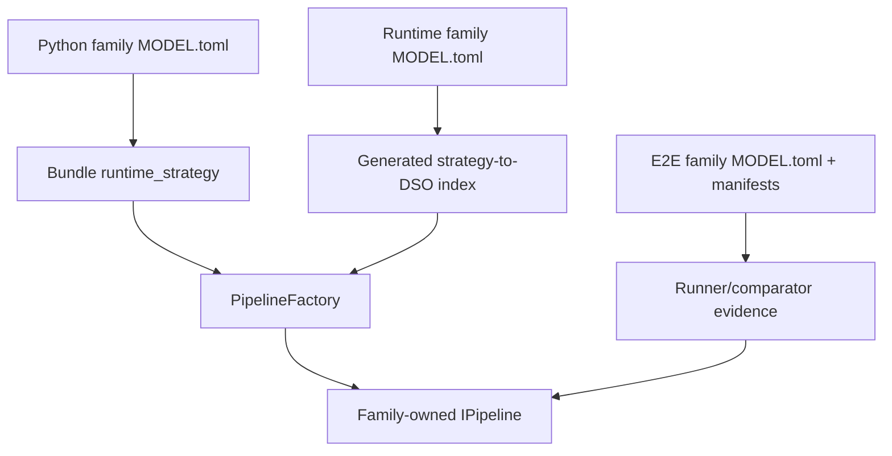

# Static Design

Status: current contract-level view. Source headers and descriptors are
authoritative.

## Public interfaces

| Contract | Authority |
| --- | --- |
| Pipeline operations and typed results | `include/trtmc/pipeline.h` |
| Bundle API | `include/trtmc/bundle.h` |
| Runtime factory | `include/trtmc/runtime/pipeline_factory.h` |
| Plugin creation contract | `include/trtmc/runtime/pipeline_plugin.h` |
| Plugin registry | `include/trtmc/runtime/pipeline_registry.h` |
| Model DSO loading | `include/trtmc/runtime/pipeline_plugin_loader.h` |
| Config bundle/schema registry | `include/trtmc/config/` |
| Tensor/device abstractions | `include/trtmc/runtime/tensor.h` and `device_tensor.h` |

## Python build contracts

The build CLI calls `engine_builder.py`, which resolves a family through
`families/__init__.py`. Each family package owns its plugin, config,
checkpoint mapping, graph construction, and optional debug runner.
`bundle_writer.py` writes the resulting engines and metadata.

The old root-level `graph_ops.py`, `graph_blocks.py`, and one-size-fits-all
decoder builder are not public architecture contracts.

## C++ runtime contracts

`PipelineFactory` owns generic materialization and dispatch. `PipelineRegistry`
stores strategy-to-plugin registrations. `PipelinePluginLoader` loads the DSO
named by generated descriptor metadata. Concrete `IPipeline` implementations,
state, kernels, and model-specific helpers remain below
`src/runtime/models/<family>/`.

Shared core/domain code must be model-independent. Static ownership tests
reject reintroduction of retired shared model implementations.

## Descriptor relationship

The descriptors share a family ID but own different concerns. A generic
`task_strategy` chooses the E2E runner/comparator contract; it must not be
confused with the concrete `runtime_strategy`.
